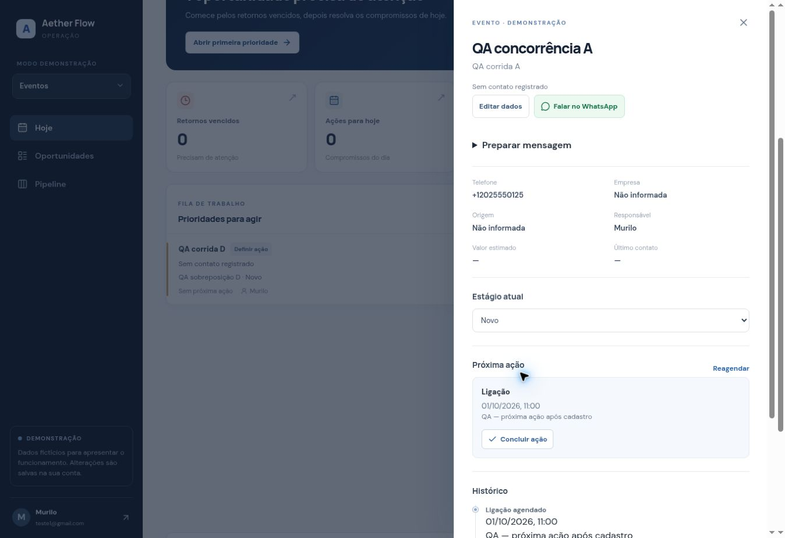

# Aether Flow — estado da implementação em 30/09/2026

**O programa de quatro prompts não está concluído.** O núcleo do Prompt 1 foi implementado na branch `core-execution-20260930`, com PR #13 em rascunho. Os testes de código e banco abaixo passaram. O acesso autenticado foi confirmado após o login do usuário; nenhuma senha foi lida ou alterada. O fluxo principal passou no navegador desktop e no banco. A Railway voltou para `main`, commit f08f915, deployment e63fa615-39b2-48c1-9caf-89bf08a5127a SUCCESS, confirmado pelo conector independente. Mobile e ativação da fronteira de escrita continuam pendentes. Não houve merge.

Fonte canônica: https://github.com/murilosuporte5-rgb/aether-flow/pull/13.

## 1. Funcionalidades implementadas na branch

- Conclusão transacional de atividade com próxima ação obrigatória ou encerramento ganho/perdido.
- Motivos controlados de perda; “Outro” exige explicação; histórico registra ator, horário e payload.
- Criação compacta: cliente, telefone obrigatório, oportunidade, valor e próxima ação; campos secundários em “Mais detalhes”. A meta de 15–20 segundos ainda não foi medida.
- Normalização de telefone, representação canônica +E.164 e índice único por empresa/telefone. Dados antigos sem telefone continuam legíveis.
- Aviso de duplicidade, visualização do cliente e reutilização explícita para outra oportunidade.
- Comandos idempotentes: repetir o mesmo identificador/payload retorna a mesma oportunidade; reaproveitar o identificador com conteúdo diferente é rejeitado.
- Botões de WhatsApp em Hoje, prioridades, lista, pipeline e detalhes. Link oficial wa.me; evento whatsapp_opened; nenhuma afirmação de envio ou de contato realizado.
- Mensagem pré-preenchida e cópia de texto. Sem envio automático.
- Dias sem contato, limiares 3/7 dias e ordenação operacional determinística. Sem timestamp, o estado é desconhecido.
- Contato confirmado apenas por declaração explícita do usuário ao concluir a ação, com registro de resultado. Edição, comentário, mudança de estágio e abertura do WhatsApp não fabricam uma interação.
- Captura acessível no mobile, formulário com Escape/foco/teclado; validação visual em dispositivos ainda pendente.
- Demo provisionada em uma única transação, idempotente e sem inventar telefones para clientes fictícios.
- Endpoint público /api/health de liveness. Ele não mede a saúde do banco.

## 2. Arquivos modificados/adicionados

| Grupo | Arquivos |
|---|---|
| API | app/api/workspace/route.ts; app/api/health/route.ts |
| Interface | app/workspace.tsx; app/dashboard.tsx; app/core-form.tsx; app/whatsapp-action.tsx; app/stale-indicator.tsx; app/globals.css; app/layout.tsx |
| Domínio/provisionamento | lib/execution.ts; lib/provision.ts; lib/request-origin.ts |
| Configuração | package.json; tsconfig.json; .gitignore |
| Testes | tests/execution.test.ts; tests/request-origin.test.ts; tests/core-acceptance.sql; tests/demo-acceptance.sql; docs/qa/aether-flow-qa-20260930-1601.jpg |
| Migrações | três arquivos listados abaixo |
| Operação | docs/CORE_RELEASE.md; docs/IMPLEMENTATION_STATUS.md; docs/pending/core_mutation_boundary.sql |

A formatação expandiu arquivos que antes estavam comprimidos em poucas linhas. O PR contém a implementação e o procedimento de publicação/recuperação.

## 3. Migrações

| Versão/nome | Estado no banco |
|---|---|
| 20260930130958_core_execution_engine | APPLIED |
| 20260930132228_core_atomic_demo | APPLIED |
| 20260930134524_core_international_phone | APPLIED |

Os nomes/versões foram cruzados com supabase_migrations.schema_migrations. As dez migrações preexistentes também correspondem aos arquivos do repositório. Os acréscimos são compatíveis com o runtime antigo. Não houve remoção de dados de clientes.

**Ativação de permissões:** docs/pending/core_mutation_boundary.sql está preparado e NÃO APLICADO. Ficou fora da pasta de migrações para não ser executado antes do runtime transacional. Depois do QA, gerar uma nova migração pelo CLI, aplicar esse SQL e sincronizar a versão efetivamente registrada.

## 4. Schema alterado

- contacts.phone_normalized: coluna gerada pela normalização; índice único parcial (company_id, phone_normalized).
- opportunities.loss_reason e loss_note; check de motivos controlados.
- opportunity_history.payload: JSONB para eventos estruturados.
- workspace_commands: chave company_id/actor_id/request_id, comando, resultado e timestamp; suporte à idempotência.
- normalize_contact_phone, apply_workspace_command, ensure_demo_workspace e helper privado de histórico.
- FKs compostas já existentes para contato, estágio, responsável e atividade foram preservadas e conferidas.

## 5. RLS e autorização

- workspace_commands tem RLS; leitura exige ser o ator e membro da empresa. Sem escrita direta por authenticated/anon.
- RPC operacional valida auth.uid() e vínculo com a empresa antes de qualquer consulta/gravação; lookups e referências são restritos à empresa.
- RPC de demo restringe o ambiente ao dono autenticado da demo, com parâmetros limitados e lock transacional.
- Funções expostas têm search_path vazio; execução PUBLIC/anon revogada. Nenhum service_role foi adicionado ao cliente.
- Testes adversariais comprovaram leitura isolada das entidades core/receipts e rejeição de RPC/opportunity ID de outra empresa.
- O histórico não aceitou alteração/remoção nos testes sob authenticated.
- **Pendente:** retirar a escrita REST direta nas entidades operacionais após a implantação verificada. Até isso acontecer, a imposição do novo fluxo não deve ser considerada concluída contra todos os caminhos de acesso.
- Auditoria completa de todas as tabelas/verbos, trial/admin e futuras rotas pertence ao Prompt 4 e não está concluída.

## 6. Edge Functions

Nenhuma Edge Function foi modificada ou publicada. create-access foi lida na versão atual. Sua compensação não verifica os resultados da limpeza e pode afirmar que não deixou acesso parcial sem comprovação; correção e testes continuam pendentes.

## 7. Testes executados

| Verificação | Resultado | Limite |
|---|---|---|
| npm test | PASS — 11 testes | Domínio e origem HTTP; UI testada separadamente |
| npm run check | PASS | TypeScript da aplicação; Edge Functions excluídas pelo tsconfig existente |
| npm run build | PASS | Build de produção local |
| tests/core-acceptance.sql | PASS — 23 verificações no PostgreSQL | Fixtures transacionais, rollback ao final |
| tests/demo-acceptance.sql | PASS — 5 verificações no PostgreSQL | Fixtures transacionais, rollback ao final |
| Runtime local /api/health e /login | HTTP 200 | Sem sessão autenticada |
| Deploy temporário dbcd9a0 | SUCCESS; health/login HTTP 200 | Anterior aos refinamentos finais de telefone/acessibilidade |
| Restore main f08f915 | SUCCESS; /login HTTP 200 | Versão anterior do produto |
| Sessão autenticada | PASS — acesso fornecido pelo usuário | Sem leitura/troca de senha |
| UI desktop | PASS — criação, telefone, duplicidade, próxima ação, ganho/perda, histórico e persistência | Empresa de QA separada; dados fictícios |
| Mobile 360/390/412/768 | NOT_TESTED | Browser disponível não expõe ajuste de viewport |
| Duas requisições HTTP simultâneas | PASS — uma 200 e outra 409; um contato/uma oportunidade | Sobreposição observada em logs Railway; sobreposição interna de transações PostgreSQL não comprovada |

As verificações no PostgreSQL cobrem telefone ausente/inválido/válido, deduplicação/reutilização, idempotência, conclusão sem próximo passo rejeitada, falha após atualização da ação anterior com rollback, conclusão com nova ação, ganho/perda, motivo/Outro, histórico de WhatsApp sem falso contato, isolamento de empresas e telefone internacional.

## 8. Evidências de PASS

- Falha proposital no timestamp da próxima ação ocorreu depois da atualização da ação anterior: a atividade permaneceu pending e a quantidade de eventos não mudou.
- Repetir request_id com o mesmo comando devolveu o mesmo ID e não criou outra oportunidade; payload diferente foi rejeitado.
- O telefone internacional +1 415 555 2671 foi gravado como +14155552671, normalizado como 14155552671 e rejeitado como duplicado na segunda tentativa.
- Actor A não leu as entidades de B e não executou comandos em B; B também não leu entidades de A nem alterou o ID de A.
- Após rollback/limpeza dos fixtures: 3 perfis, 2 empresas, 0 contatos, 0 oportunidades, 0 atividades, 0 histórico e 0 receipts, como no baseline operacional.
- A consulta de deployments indicou SUCCESS e canRollback=true para os deployments de teste e restauração.

## 9. Bugs/problemas encontrados

1. Conclusão anterior permitia terminar sem próximo passo.
2. Criação/agendamento/conclusão anteriores usavam gravações separadas, sujeitas a estado parcial.
3. Cadastro anterior permitia ausência de telefone e não deduplicava.
4. Botões anteriores de WhatsApp não registravam abertura.
5. Edição/comentário/estágio atualizavam last_interaction_at sem comprovação de contato.
6. Deadline anterior ignorava a hora nos atrasos do mesmo dia.
7. Na primeira implementação, país internacional podia desaparecer após normalizar/gravar; teste de round-trip detectou o problema.
8. Compensação administrativa existente não conferia o sucesso da limpeza.
9. Leaked-password protection desabilitada, conforme advisor.

Itens 8/9 são pendências identificadas, não falhas de cliente observadas nem correções concluídas.

10. POST era rejeitado por “Origem não permitida” atrás do proxy Railway. Corrigido usando RAILWAY_PUBLIC_DOMAIN no servidor e comparação estrita de origem; três regressões PASS. Escritas reais posteriores PASS.
11. Botão Agendar da fila Hoje abria detalhes. Corrigido para abrir formulário de agendamento diretamente; gravação verificada.
12. Abertura WhatsApp na fila não disparava atualização do snapshot; callback adicionado. A gravação do evento já foi comprovada, atualização visual desse callback ainda não testada separadamente.

## 10. Bugs corrigidos

Itens 1–7, 10 e 11 foram tratados na branch e nos testes descritos; item 12 foi corrigido no código com a limitação de QA registrada acima. Demo também passou a ter gravação atômica. Não foi alegada correção de todas as falhas do produto existente.

## 11. Limitações restantes / dependências

| MISSING | WHY | DEPENDENCY | NEXT_ACTION |
|---|---|---|---|
| QA mobile do núcleo | Viewport não configurável no browser disponível | Dispositivo ou ferramenta de viewport suportada | Testar 360/390/412/768, formulários e navegação |
| Concorrência PostgreSQL forçada | Probe de pg_blocking_pids retornou zero | Conexões independentes instrumentadas | HTTP simultâneo passou; aprofundar se necessário sem confundir com prova de lock interno |
| Bloqueio de mutações diretas | Runtime antigo restaurado | Novo runtime aprovado | Aplicar SQL de ativação e testar bypass/RLS novamente |
| Merge/release do núcleo | Gates incompletos | PASS nos itens acima | Merge; fonte main; deployment final SUCCESS |
| Prompts 2, 3 e 4 | Sua regra proíbe avançar antes de estabilizar o Prompt 1 | Núcleo aprovado | Retomar auditoria do que já existe e implementar apenas lacunas |

## 12. Dívida técnica

- Snapshot carrega todos os registros/histórico da empresa; paginação/performance devem ser verificadas com volume real.
- Validar compensação administrativa, onboarding real, autorização/rate limits e reset no sprint correspondente.
- Definir política futura de retenção de receipts sem retirar a proteção de idempotência prematuramente.
- RLS de edição de pipeline deve corresponder a owner/admin quando a configuração for implementada.
- Advisors: dois WARN de SECURITY DEFINER aceitos intencionalmente para a fronteira transacional, com as proteções acima; revisão final independente pendente. Leaked-password protection continua pendente. Não foram removidos índices de FK/fluxo por não terem uso em um banco sem dados comerciais.

## 13. Funcionalidades adiadas

Prompts 2–4 continuam aguardando o gate do núcleo: fila Resolver Pendências, pipeline configurável, Contatos/busca global, feedback, métricas, CSV, admin/trial/reset/export e hardening/E2E completos. Funcionalidades preexistentes não foram contabilizadas como entregas novas.

WhatsApp Cloud API, IA/chatbot, Stripe completo, ERP, automação multicanal, app nativo e BI complexo seguem fora do escopo, conforme sua instrução.

## 14. Deployment exato

| Uso | ID | Commit/fonte | Estado confirmado |
|---|---|---|---|
| Teste temporário | f188cf1a-6f31-4d10-a5c8-52af5ff2c071 | 74568433127876192f09cb2900b820dc694f86d3 / core-execution-20260930 | SUCCESS; substituído pela restauração |
| Restauração atual | e63fa615-39b2-48c1-9caf-89bf08a5127a | f08f9157fc0786afd2b0d20529f1e260d87f38a5 / main | SUCCESS |

Configuração de produção conferida independentemente: main, commit f08f915, healthcheck /login, timeout 30s; deployment e63fa615-39b2-48c1-9caf-89bf08a5127a SUCCESS às 16:03:31 UTC. Domínio, variáveis, réplicas e dados de clientes preservados. **Os novos recursos ainda não foram incorporados a main.**

## 15. Riscos antes de operar clientes reais

- Não declarar o núcleo aprovado sem concluir QA mobile e ativação da fronteira de escrita; o desktop autenticado e as requisições HTTP sobrepostas passaram.
- Não operar criação de acessos sem revisar a compensação e recuperação administrativa.
- Não considerar os avisos de Auth/advisors resolvidos apenas por registrar uma justificativa.
- Não vender trial, CSV, reset, fila ou métricas como implementados neste trabalho.
- Login já foi resolvido. Para continuar: QA mobile → ativar bloqueio de mutações diretas e retestar RLS/RPC → merge → main → deployment SUCCESS. Os Prompts 2–4 permanecem pendentes pela ordem exigida.

## Evidência da rodada autenticada

- QA separada: criação com telefone internacional, reutilização explícita (1 contato/2 oportunidades), conclusão com nova ação (1 done/1 pending), ganho e perda (0 pending e próximo passo nulo), motivo Outro com nota/ator/timestamp.
- Ausência de próximo passo/motivo/descrição bloqueou envio no navegador; SQL verificou estado persistido.
- WhatsApp abriu link oficial e registrou somente whatsapp_opened; last_interaction_at continuou nulo. Protocolo do aplicativo não pôde ser inspecionado pelo browser de QA. Nenhuma mensagem enviada.
- Requisições POST /api/workspace em 15:57:33.400769448Z (919 ms, 200) e 15:57:33.706900038Z (1264 ms, 409) possuem intervalos sobrepostos. Banco: telefone 12025550126, 1 contato/1 oportunidade.
- Primeiro ensaio com lock de 20 segundos gerou erro recuperável de gravação numa aba; retry exibiu duplicidade e não duplicou. Segundo probe de lock retornou 0 sessões bloqueadas: não comprova concorrência interna do banco.
- Atualização da página preservou os dados. Agendar pela fila Hoje abriu diretamente o formulário e criou 1 ação pendente para 01/10/2026 às 11:00 Bahia (14:00 UTC).
- Dados fictícios removidos somente da empresa QA criada nesta rodada, em transação protegida por ID/nome/dono. Contagens finais: 2 empresas, 3 perfis, zero contatos/oportunidades/atividades/histórico/receipts. Empresa real e Auth preservados.
- Commit de código validado: 74568433127876192f09cb2900b820dc694f86d3. Railway QA f188cf1a-6f31-4d10-a5c8-52af5ff2c071 SUCCESS, health /api/health HTTP 200.

